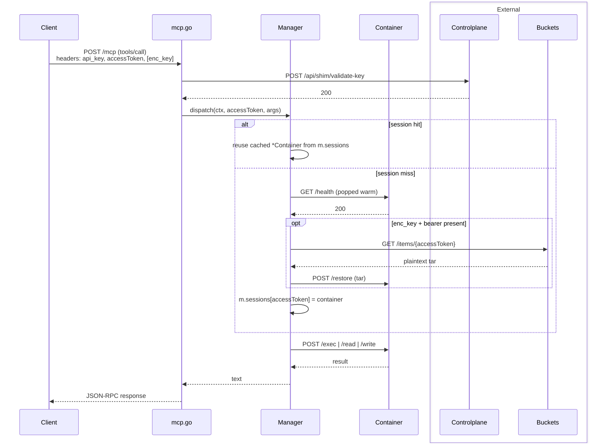
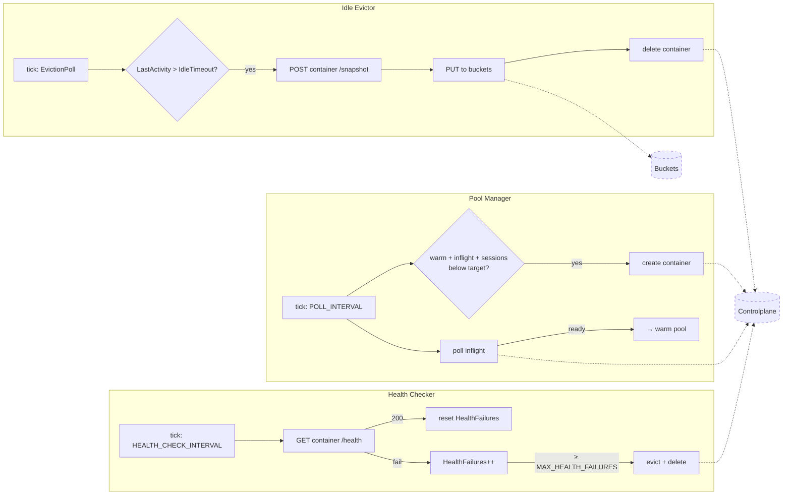
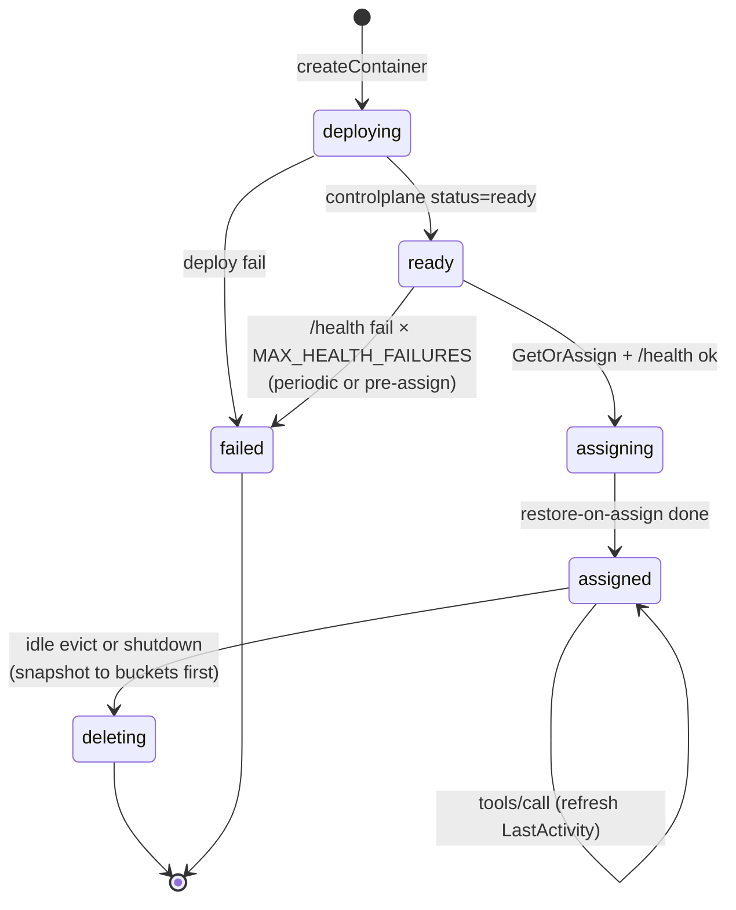

# Code Execution

## MCP tools

- `bash` — run a bash command in the container; returns stdout, stderr, exit code.
- `view` — read a file with line numbers, optionally a `[start, end]` range.
- `present` — render a file inline in the chat as a syntax-highlighted code block (the user sees it directly).
- `str_replace` — replace one exact occurrence of `old_str` with `new_str` in a file.
- `create` — create a new file with given contents; fails if it already exists.
- `insert` — insert text after a given line number in a file.

## Flow

### Tool call



### Background loops



### Container lifecycle



## Manager

Manages a warm pool of executor containers via the Tinfoil controlplane API. Routes requests by session ID so each client gets an isolated sandbox. The primary tool interface is MCP (`POST /mcp`).

### Run

```bash
export ADMIN_API_KEY="..."
go run .
```

Or build a binary:

```bash
go build .
./confidential-code-execution
```

### Environment variables

| Variable           | Default                                | Notes                              |
| ------------------ | -------------------------------------- | ---------------------------------- |
| `ADMIN_API_KEY`    | _(required)_                           | Tinfoil controlplane bearer token  |
| `POOL_SIZE`        | `3`                                    | Target warm pool size              |
| `MAX_CONTAINERS`   | `10`                                   | Hard cap on concurrent containers  |
| `PORT`             | `7070`                                 | manager listen port                |
| `POLL_INTERVAL`    | `2`                                    | Seconds between controlplane polls |
| `ENVIRONMENT_REPO` | `tinfoilsh/code-execution-environment` | Source repo for the executor image |
| `ENVIRONMENT_TAG`  | `v0.0.9`                               | Image tag to deploy                |

|  
| `DEV_SKIP_ATTESTATION` | `false` | Local dev only — skip enclave attestation + TLS pinning. Never set in prod. |
| `DEV_BYPASS_AUTH` | `false` | Local dev only — skip api_key validation. Never set in prod. |
| `HEALTH_CHECK_INTERVAL` | `15` | Seconds between `/health` probes of warm containers. |
| `MAX_HEALTH_FAILURES` | `3` | Consecutive `/health` failures before a warm container is destroyed and replaced. |
| `SHUTDOWN_DEADLINE` | `25` | Seconds spent snapshotting sessions on SIGTERM before bulk-delete. Tune per platform grace period. |

### API

All tool access is through the single MCP endpoint. The session is identified by the per-chat secret in the `X-Code-Execution-Access-Token` header.

```
POST /mcp
Headers: X-Code-Execution-Access-Token: <token>
Body: JSON-RPC 2.0

Methods:
  initialize       — handshake
  tools/list       — list available tools
  tools/call       — invoke a tool (params: {name, arguments})

Tools: bash, view, present, str_replace, create, insert
```

Other endpoints:

```
GET /metrics — full container details (used by viz.py)
```

On `SIGINT`/`SIGTERM` the manager snapshots every active session to
buckets, deletes every container it owns on controlplane, then exits —
so a deploy or local `ctrl-c` doesn't leak containers or session state.

### Visualizer

```bash
python viz.py
```

Polls `/metrics` every second. Shows warm pool (green), inflight (yellow), active sessions (cyan), and failures (red).

## Environment Container

_in code-execution-environment repo_

- **api-server** (port 8000) — HTTP API exposed via the Tinfoil shim. Proxies requests to the executor.
- **executor** (port 9000) — Runs bash commands and serves file read/write.

### API

```
POST /exec   {"command": "echo hello"}
             → {"stdout": "hello\n", "stderr": "", "exit_code": 0}

POST /read   {"path": "/workspace/file.txt"}
             → {"path": "...", "contents": "<base64>"}

POST /write  {"path": "...", "contents": "<base64>"}
             → {"path": "...", "size": 42}

GET  /health → {"status": "ok"}
```
