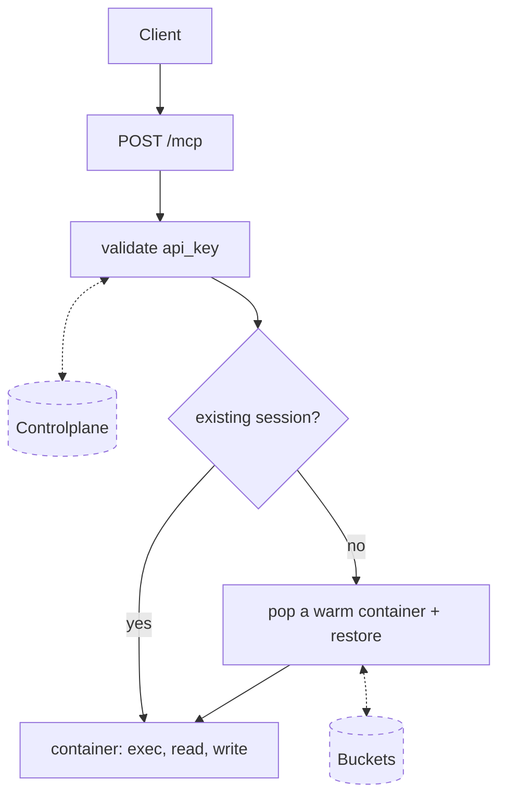
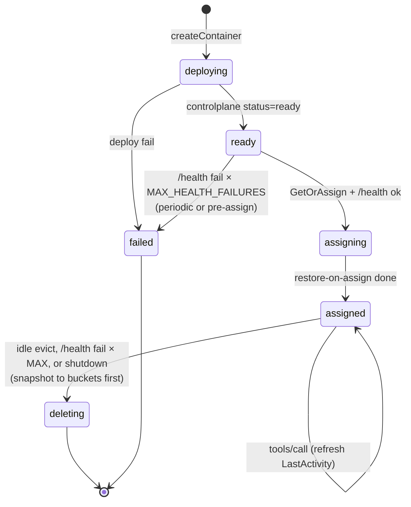

# Code Execution

## MCP tools

- `bash` — run a bash command in the container; returns stdout, stderr, exit code.
- `view` — read a file with line numbers, optionally a `[start, end]` range.
- `present` — render a file inline in the chat as a syntax-highlighted code block (the user sees it directly).
- `str_replace` — replace one exact occurrence of `old_str` with `new_str` in a file.
- `create` — create a new file with given contents; fails if it already exists.
- `insert` — insert text after a given line number in a file.

## Flows

### Background loops

The manager runs three background loops alongside the request path:

- **Pool manager** — keeps the warm pool topped up. Each tick creates new containers via controlplane and promotes any inflight ones that hit `ready`.
- **Health checker** — probes `/health` on every warm and assigned container. After `MAX_HEALTH_FAILURES` consecutive failures, evicts: plain delete for warm, snapshot-then-delete for sessions.
- **Idle evictor** — scans sessions for `LastActivity > IdleTimeout`. Snapshots the container's `/workspace` to buckets, then deletes the container.

### E2E



### Container lifecycle



## Manager

Manages a warm pool of executor containers via the Tinfoil controlplane API. Routes requests by session ID so each client gets an isolated sandbox. The primary tool interface is MCP (`POST /mcp`).

### Run

```bash
export ADMIN_API_KEY="..."
go run .
```

Or build a binary:

```bash
go build .
./confidential-code-execution
```

### Environment variables

| Variable                   | Default                                | Notes                                                                                                     |
| -------------------------- | -------------------------------------- | --------------------------------------------------------------------------------------------------------- |
| `ADMIN_API_KEY`            | _(required)_                           | Tinfoil controlplane bearer token.                                                                        |
| `CONTROL_PLANE_URL`        | `https://api.tinfoil.sh`               | Controlplane base URL (container CRUD + api_key validation).                                              |
| `BUCKETS_BASE`             | `https://buckets.tinfoil.sh`           | Buckets base URL (encrypted snapshot store).                                                              |
| `PORT`                     | `7070`                                 | Manager listen port.                                                                                      |
| `POOL_SIZE`                | `3`                                    | Target warm pool size.                                                                                    |
| `MAX_CONTAINERS`           | `10`                                   | Hard cap on concurrent containers (warm + inflight + sessions).                                           |
| `POLL_INTERVAL`            | `2`                                    | Seconds between pool-manager ticks. Backs off up to 30s on consecutive controlplane failures.             |
| `ENVIRONMENT_REPO`         | `tinfoilsh/code-execution-environment` | Source repo for the executor image.                                                                       |
| `ENVIRONMENT_TAG`          | `v0.0.9`                               | Image tag to deploy.                                                                                      |
| `IDLE_TIMEOUT`             | `60`                                   | Seconds of session inactivity before snapshot+evict.                                                      |
| `EVICTION_POLL`            | `30`                                   | Seconds between idle-evictor scans.                                                                       |
| `WARM_POOL_WAIT_TIMEOUT`   | `10`                                   | Seconds a `tools/call` will wait for a warm container before returning an at-capacity error.              |
| `HEALTH_CHECK_INTERVAL`    | `15`                                   | Seconds between `/health` probes of warm and session containers.                                          |
| `MAX_HEALTH_FAILURES`      | `3`                                    | Consecutive `/health` failures before evicting a container (warm: delete; session: snapshot then delete). |
| `MAX_CONCURRENT_SNAPSHOTS` | `4`                                    | Cap on in-memory snapshot/restore tar buffers. Backstop against OOM under load.                           |
| `SHUTDOWN_DEADLINE`        | `25`                                   | Seconds spent snapshotting sessions on SIGTERM before bulk-delete. Tune per platform grace period.        |

Build tags:

- `-tags dev` — disables enclave attestation + TLS pinning (`proxy_dev.go`) and api_key validation (`auth_dev.go`). Local dev only; never ship a binary built with this tag.

### API

All tool access is through the single MCP endpoint. The session is identified by the per-chat secret in the `X-Code-Execution-Access-Token` header.

```
POST /mcp
Headers: X-Code-Execution-Access-Token: <token>
Body: JSON-RPC 2.0

Methods:
  initialize       — handshake
  tools/list       — list available tools
  tools/call       — invoke a tool (params: {name, arguments})

Tools: bash, view, present, str_replace, create, insert
```

Other endpoints:

```
GET /metrics — Prometheus scrape endpoint
```

Counters: `orchestrator_containers_created_total`,
`..._deleted_total`, `..._snapshots_total{result}`, `..._restores_total{result}`,
`..._health_failures_total{kind}`, `..._attestation_failures_total`,
`..._controlplane_errors_total`. Gauges: `..._warm_pool_size`,
`..._inflight_size`, `..._sessions_active`, `..._pool_target`,
`..._max_containers`.

On `SIGINT`/`SIGTERM` the manager snapshots every active session to
buckets in parallel within `SHUTDOWN_DEADLINE`, then bulk-deletes every
container it owns on the controlplane and exits — so a deploy or local
`ctrl-c` doesn't leak containers. Sessions whose snapshot doesn't
finish within the deadline still get deleted; their workspace state is
lost.

### Local visualizer

```bash
./viz.sh                    # default: http://localhost:7070
./viz.sh http://host:port   # custom URL
```

Wraps `watch -n 1 'curl -s URL/metrics | grep orchestrator_'`.

## Environment Container

_in code-execution-environment repo_

- **api-server** (port 8000) — HTTP API exposed via the Tinfoil shim. Proxies requests to the executor.
- **executor** (port 9000) — Runs bash commands and serves file read/write.

### API

```
POST /exec     {"command": "echo hello"}
               → {"stdout": "hello\n", "stderr": "", "exit_code": 0}

POST /read     {"path": "/workspace/file.txt"}
               → {"path": "...", "contents": "<base64>"}

POST /write    {"path": "...", "contents": "<base64>"}
               → {"path": "...", "size": 42}

POST /restore  {"tar": "<base64>"}            (called by orchestrator pre-assign)
               → {"status": "ok"}

POST /snapshot {}                             (called by orchestrator on evict)
               → {"tar": "<base64>"}          + trailer X-Snapshot-Status: ok

GET  /health   → {"status": "ok"}
```
